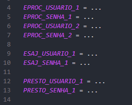

# legal-bots
Ecossistema de bots para extrair dados e cópias dos principais sistema judiciários brasileiro.

## Primeiros Passos
1. Execute `npm install` para instalar as dependências necessárias;
2. Depois execute `npx playwright install` para installar o Playwright;

## Credenciais
Insira suas credenciais em um `.env`na raíz do projeto, como na imagem abaixo no formato `<sistema>_USUARIO_<índice>`:

